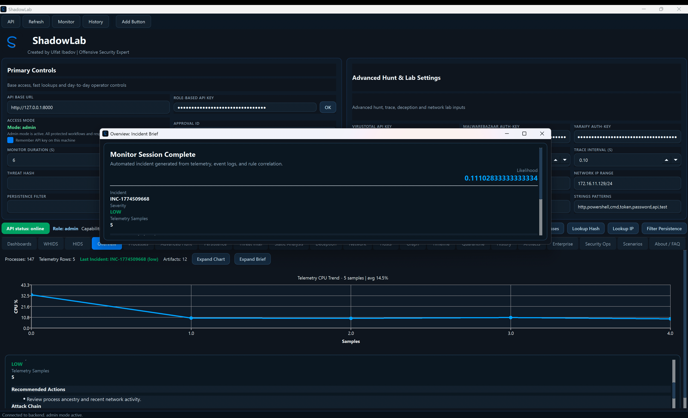
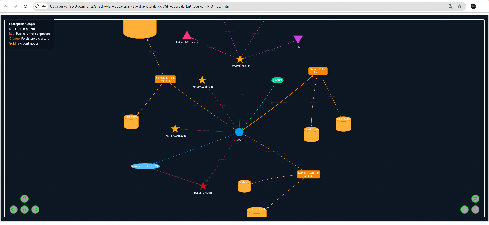

# ShadowLab

> Use only in systems and networks you own or explicitly control.

**Created by [Ulfat Ibadov](https://www.linkedin.com/in/ibadovulfat/)**

ShadowLab is a Windows-focused security operations and research platform built around a local FastAPI backend and a PySide6 desktop client. It brings host telemetry, process investigation, persistence review, threat enrichment, response controls, graph and timeline context, deception tooling, and enterprise casework into one stack.

## What It Covers

- local telemetry collection and incident artifact generation
- process profiling, tree review, strings, internals, sandbox trace, YARA, and memory analysis
- persistence discovery, remediation, rollback, quarantine, and evidence capture
- threat-intelligence lookups for hashes and IPs
- `WHIDS` and `OSSEC/HIDS` ingest, live validation, and response orchestration
- case-driven enterprise workflow with assignments, tasks, notes, stories, pins, and exports
- `MITRE ATT&CK` lifecycle, coverage, Navigator export, and Workbench export
- security-operations controls for integrity, observability, secrets, readiness, and retention

## Desktop Sections

The current desktop client includes:

- `Dashboards`
- `WHIDS`
- `HIDS`
- `Overview`
- `Processes`
- `Advanced Hunt`
- `Persistence`
- `Threat Intel`
- `Static Analysis`
- `Deception`
- `Network`
- `Hosts`
- `Graph`
- `Timeline`
- `Quarantine`
- `History`
- `Artifacts`
- `Enterprise`
- `Security Ops`
- `Scenarios`
- `About / FAQ`

Inside `Enterprise`, the workspace is split into `Enterprise Ops` and `Enterprise Intel`.

## Architecture

```text
api/         FastAPI routes, RBAC, policy enforcement, and request signing
core/        shared models and normalization helpers
services/    investigation, response, telemetry, enterprise, and graph logic
detections/  behavioral rules and scoring support
plugins/     host-native collection, response, YARA, and forensic modules
desktop/     PySide6 operator client
docs/        platform, usage, and operational guides
scripts/     startup, packaging, migration, and validation helpers
```

## Local YARA Layer

ShadowLab uses a layered YARA workflow tuned for Windows tradecraft:

- `YARAify` as the first external lookup
- local fallback and deep scan using ShadowLab rules plus curated community packs
- dedicated `Inceptor_*` and `Memory_*` rules for AMSI, ETW, manual map, APC, syscall, and unhooking tradecraft
- policy, tuning, telemetry, and compile-health reporting through the `Security Ops` workspace

Latest validated state:

- `enterprise_rules_requested = 1163`
- `enterprise_rules_loaded = 1163`
- `compile_error_count = 0`

Detailed notes are in [plugins/rules/YARA_VALIDATION.md](plugins/rules/YARA_VALIDATION.md).

## Static Analysis

The `Static Analysis` workspace can use Detect It Easy through the native `die-python` binding or an optional external binary:

- preferred backend: native `die-python`
- optional subprocess backend: `diec.exe` or `die.exe` via `SHADOWLAB_DIEC_PATH` or `PATH`
- fallback path: `pefile`-based structural PE analysis
- native DiE execution is isolated in a worker process to reduce crash impact
- the desktop now reports native runtime readiness correctly even when no external `diec.exe` path is configured

## Reporting And Artifacts

Monitor and case exports now produce fuller report output instead of a thin summary page.

- `ShadowLab_Report.pdf` includes executive summary, detection breakdown, analyst findings, response guidance, telemetry snapshot, security-event highlights, and artifact inventory
- `ShadowLab_Report.html` mirrors the same structure in a handoff-friendly format
- `Artifacts` is the quickest place to pull the current report set, telemetry exports, and investigation output

More detail is in [docs/DIE_INTEGRATION.md](docs/DIE_INTEGRATION.md).

## Quick Start

### 1. Create a virtual environment

```powershell
python -m venv venv
venv\Scripts\activate
pip install -r requirements.txt
```

### 2. Start the API

Basic local start:

```powershell
python app.py
```

Auth-enabled local start:

```powershell
powershell -ExecutionPolicy Bypass -File scripts\start_shadowlab_auth.ps1
```

That path enables role-aware auth, generates fresh keys when needed, and keeps dangerous actions off unless you opt in.

### 3. Start the desktop client

```powershell
python desktop\main.py
```

The desktop expects the backend at `http://127.0.0.1:8000` by default.

## Auth Model

ShadowLab supports three roles:

- `viewer`
- `analyst`
- `admin`

Relevant environment variables:

- `SHADOWLAB_REQUIRE_AUTH`
- `SHADOWLAB_API_KEYS`
- `SHADOWLAB_API_KEYS_SHA256`
- `SHADOWLAB_ALLOWED_ORIGINS`
- `SHADOWLAB_POLICY_PROFILE`
- `SHADOWLAB_NOAUTH_DEFAULT_ROLE`

Recommended practice:

1. generate fresh keys with `scripts\generate_api_keys.py`
2. store SHA-256 digests instead of raw keys where possible
3. keep `viewer` and `analyst` keys separate from admin workflows
4. use approval IDs for higher-risk actions in stricter policy profiles

Authenticated write operations now require signed requests. The desktop client handles that automatically.

## Validation

Useful checks shipped with the repository:

- `python scripts/validate_deployment_runtime.py`
- `python scripts/rbac_smoke_matrix.py`
- `python scripts/perf_stability_probe.py`
- `python scripts/smoke_test_live_integrations.py --base-url http://127.0.0.1:8000 --api-key <raw_admin_key>`
- `powershell -ExecutionPolicy Bypass -File scripts\validate_ossec_active_response.ps1 -OssecHome C:\Users\ulfat\Documents\ossec-hids-main`

## Packaging

```powershell
pip install pyinstaller
desktop\build_exe.ps1
```

Related files:

- `desktop\shadowlab.spec`
- `desktop\shadowlab.iss`
- `desktop\version_info.txt`

## Documentation

- [docs/PLATFORM_GUIDE.md](docs/PLATFORM_GUIDE.md)
- [docs/USAGE_GUIDE.md](docs/USAGE_GUIDE.md)
- [docs/PRODUCTION_RUNBOOK.md](docs/PRODUCTION_RUNBOOK.md)
- [desktop/README.md](desktop/README.md)
- [ARCHITECTURE.md](ARCHITECTURE.md)
- [TOP10_ROADMAP.md](TOP10_ROADMAP.md)

## Screenshots






## Safety

This repository includes lab-only features such as response actions, deception controls, packet inspection, and network assessment helpers. Keep it in isolated environments and treat it like a security tool, not a general-purpose desktop app.
