# ShadowLab

> Use only in systems and networks you own or explicitly control.

**Created by [Ulfat Ibadov](https://www.linkedin.com/in/ibadovulfat/)**

ShadowLab is a Windows-focused cybersecurity operations platform built around a local FastAPI backend and a PySide6 desktop operator console. It brings host telemetry, process investigation, persistence review, file and malware analysis, network visibility, containment, casework, ATT&CK context, reporting, and security-operations readiness into one lab-friendly stack.

The platform is built for cybersecurity engineers, detection engineers, threat hunters, incident responders, malware analysts, and developers who want one local environment for studying Windows tradecraft, validating detections, and turning suspicious activity into structured investigation work.

## What It Covers

- local telemetry collection and incident artifact generation
- process profiling, process-tree review, strings, internals, YARA, memory analysis, sandbox traces, and AI-assisted triage
- persistence discovery, remediation, rollback, quarantine-aware containment, and evidence capture
- file-focused malware analysis with native Detect It Easy support and PE fallback
- `WHIDS` and `OSSEC/HIDS` ingest, live validation, artifact pull, scheduler state, and response planning
- network connection review, packet capture, ARP discovery, entity graphing, and timeline reconstruction
- antivirus-style containment with provider health, verdict history, quarantine, response, lists, rules, and webhooks
- case-driven enterprise workflow with assignments, tasks, notes, stories, pins, exports, and ATT&CK coverage
- security-operations controls for integrity, observability, secrets, readiness, audit export, and retention
- workspace-aware enterprise records, approval scoping, tenant-aware exports, and identity-backed RBAC groundwork

## Desktop Sections

The current desktop client includes:

- `Dashboards`
- `WHIDS`
- `HIDS`
- `Overview`
- `Processes`
- `Persistence`
- `File Analysis`
- `Network`
- `Graph`
- `Timeline`
- `Antivirus`
- `History`
- `Artifacts`
- `Enterprise`
- `Security Ops`
- `About / FAQ`

Inside `Enterprise`, the workspace is split into `Enterprise Ops` and `Enterprise Intel`.

## Architecture

```text
api/         FastAPI routes, RBAC, policy enforcement, request signing, and workers
core/        shared policy, models, workspace context, and normalization helpers
services/    investigation, response, telemetry, enterprise, graph, antivirus, and security logic
detections/  behavioral rules and scoring support
plugins/     host-native collection, YARA, forensic, sandbox, and network helpers
desktop/     PySide6 operator client
docs/        platform, usage, production, security, and architecture documentation
scripts/     startup, packaging, migration, validation, backup, and audit helpers
```

## Local YARA Layer

ShadowLab uses a layered YARA workflow tuned for Windows tradecraft:

- `YARAify` as the first external lookup when configured
- local fallback and deep scan using ShadowLab rules plus curated community packs
- dedicated `Inceptor_*` and `Memory_*` rules for AMSI, ETW, manual map, APC, syscall, and unhooking tradecraft
- policy, tuning, telemetry, and compile-health reporting through `Security Ops`

Latest validated state:

- `enterprise_rules_requested = 1163`
- `enterprise_rules_loaded = 1163`
- `compile_error_count = 0`

Detailed notes are in [plugins/rules/YARA_VALIDATION.md](plugins/rules/YARA_VALIDATION.md).

## File Analysis

The `File Analysis` workspace can use Detect It Easy through the native `die-python` binding or an optional external binary:

- preferred backend: native `die-python`
- optional subprocess backend: `diec.exe` or `die.exe` via `SHADOWLAB_DIEC_PATH` or `PATH`
- fallback path: `pefile`-based structural PE analysis
- native DiE execution is isolated in a worker process to reduce crash impact
- the desktop reports native runtime readiness correctly even when no external `diec.exe` path is configured

More detail is in [docs/DIE_INTEGRATION.md](docs/DIE_INTEGRATION.md).

## Reporting And Artifacts

Monitor, antivirus, and case exports produce handoff-friendly output.

- `ShadowLab_Report.pdf` includes executive summary, detection breakdown, analyst findings, response guidance, telemetry snapshot, security-event highlights, and artifact inventory
- `ShadowLab_Report.html` mirrors the same structure in a browser-friendly format
- `Artifacts` is the quickest place to pull current reports, telemetry exports, investigation output, and collected evidence

## Quick Start

### 1. Create a virtual environment

```powershell
python -m venv venv
venv\Scripts\activate
pip install -r requirements.txt
```

### 2. Start the API

Basic local start:

```powershell
python app.py
```

Auth-enabled local start:

```powershell
powershell -ExecutionPolicy Bypass -File scripts\start_shadowlab_auth.ps1
```

Enable lab-only destructive and network-warfare controls only when you are in an isolated environment:

```powershell
powershell -ExecutionPolicy Bypass -File scripts\start_shadowlab_auth.ps1 -EnableDangerousActions -EnableNetworkWarfare
```

### 3. Start the desktop client

```powershell
python desktop\main.py
```

The desktop expects the backend at `http://127.0.0.1:8000` by default.

## Auth Model

ShadowLab supports three roles:

- `viewer`
- `analyst`
- `admin`

Relevant environment variables:

- `SHADOWLAB_REQUIRE_AUTH`
- `SHADOWLAB_API_KEYS`
- `SHADOWLAB_API_KEYS_SHA256`
- `SHADOWLAB_ALLOWED_ORIGINS`
- `SHADOWLAB_POLICY_PROFILE`
- `SHADOWLAB_NOAUTH_DEFAULT_ROLE`
- `SHADOWLAB_OIDC_ENABLED`
- `SHADOWLAB_OIDC_ISSUER`
- `SHADOWLAB_OIDC_AUDIENCE`
- `SHADOWLAB_ROLE_WORKSPACES`
- `SHADOWLAB_ACTOR_WORKSPACES`
- `SHADOWLAB_ENABLE_DANGEROUS_ACTIONS`
- `SHADOWLAB_ENABLE_NETWORK_WARFARE`

Recommended practice:

1. generate fresh keys with `scripts\generate_api_keys.py`
2. store SHA-256 digests instead of raw keys where possible
3. keep `viewer`, `analyst`, and `admin` keys separate
4. use approval IDs for higher-risk actions in stricter policy profiles
5. in `corp` and `prod`, pass explicit workspace context and prefer OIDC-backed identity over shared API keys

Authenticated write operations require signed requests. The desktop client handles that automatically.

Current enterprise hardening highlights:

- OIDC scaffold and identity revocation support exist alongside API key auth
- `lab`, `corp`, and `prod` policy profiles share one matrix
- enterprise records, approvals, connector queue state, artifacts, and audit exports are workspace-aware
- connector storage uses tenant-aware `workspace_id + name` persistence
- replay protection, rate-limit state, request nonces, audit logs, and migration metadata are persisted

## Validation

Useful checks shipped with the repository:

- `python scripts/validate_deployment_runtime.py`
- `python scripts/rbac_smoke_matrix.py`
- `python scripts/perf_stability_probe.py`
- `python scripts/smoke_test_live_integrations.py --base-url http://127.0.0.1:8000 --api-key <raw_admin_key>`
- `powershell -ExecutionPolicy Bypass -File scripts\validate_ossec_active_response.ps1 -OssecHome <ossec_home>`
- `python scripts/validate_detection_corpus.py`

## Packaging

```powershell
pip install pyinstaller
desktop\build_exe.ps1
```

Related files:

- `desktop\shadowlab.spec`
- `desktop\shadowlab.iss`
- `desktop\version_info.txt`

## Documentation

- [docs/PLATFORM_GUIDE.md](docs/PLATFORM_GUIDE.md)
- [docs/USAGE_GUIDE.md](docs/USAGE_GUIDE.md)
- [docs/PRODUCTION_RUNBOOK.md](docs/PRODUCTION_RUNBOOK.md)
- [docs/SECURITY_REMEDIATION_RUNBOOK.md](docs/SECURITY_REMEDIATION_RUNBOOK.md)
- [docs/ENTERPRISE_ROADMAP.md](docs/ENTERPRISE_ROADMAP.md)
- [docs/POLICY_MATRIX.md](docs/POLICY_MATRIX.md)
- [desktop/README.md](desktop/README.md)
- [ARCHITECTURE.md](ARCHITECTURE.md)
- [TOP10_ROADMAP.md](TOP10_ROADMAP.md)

## Licensing

The repository's primary licensing and usage restrictions are defined in [LICENSE](LICENSE).
An Apache 2.0 text copy is also included in [LICENSE-APACHE](LICENSE-APACHE) for future dual-licensing or component-specific use, but it does not override the repository-wide terms in [LICENSE](LICENSE) unless explicitly stated for a specific file, component, or release.

## Screenshots

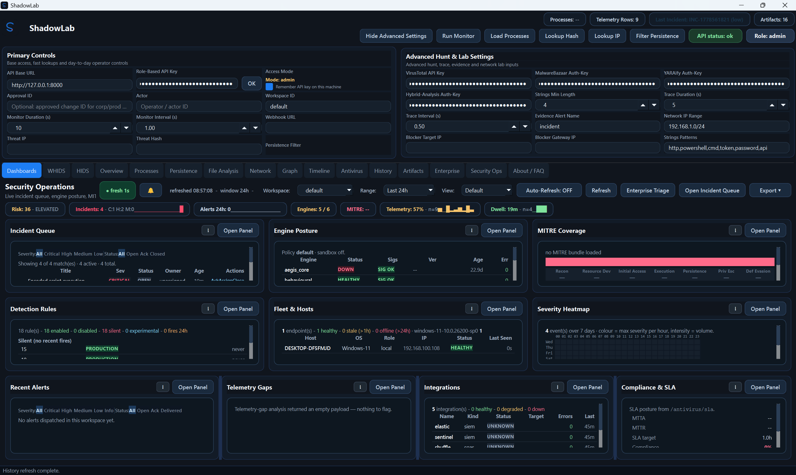
Quick SOC wall for platform health, threat posture, auth state, and workflow entry points.

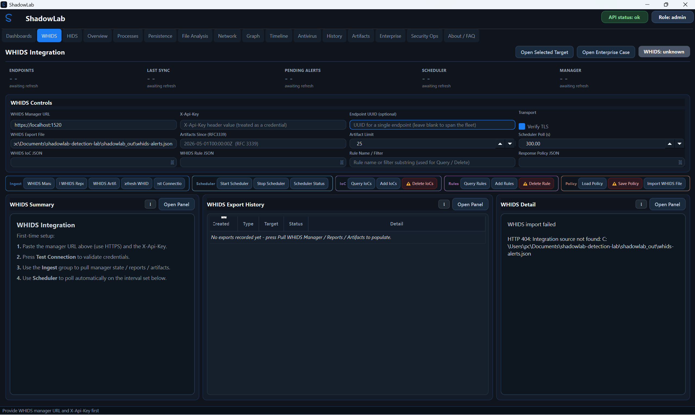
WHIDS manager sync, report ingest, artifact pull, scheduler controls, IoCs, and rules.

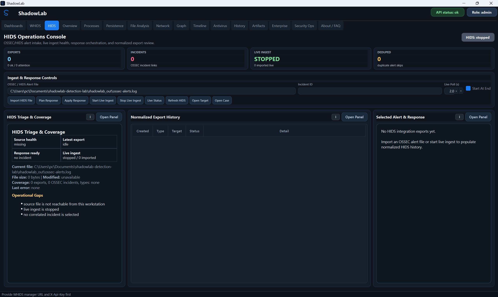
OSSEC/HIDS alert ingestion, live status, and response-oriented operations.

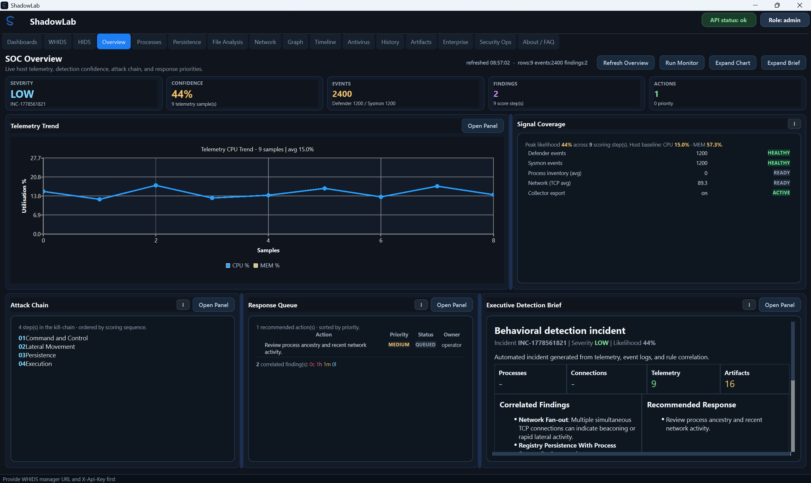
High-signal incident brief with triage context and operator summary.

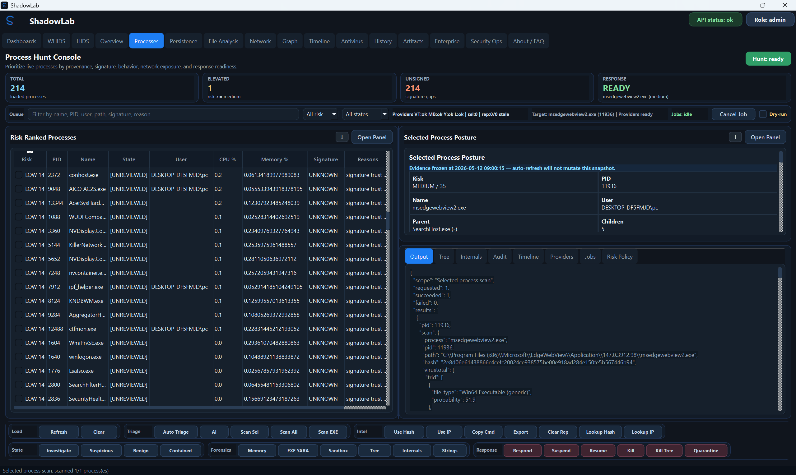
Suspicious-process investigation, profiling, tree review, strings, internals, and response action context.

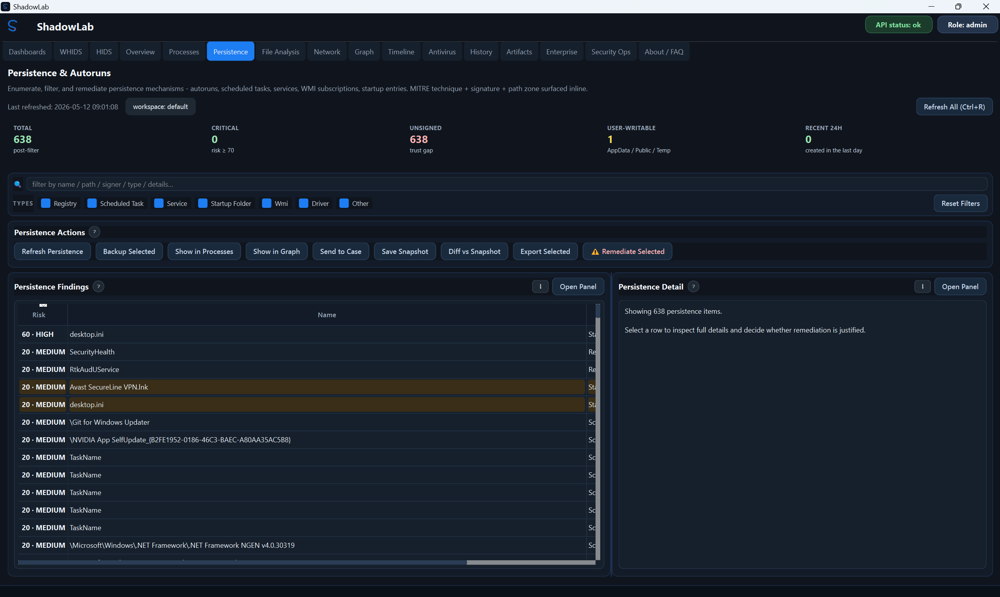
Persistence discovery and remediation workflow for long-lived footholds.

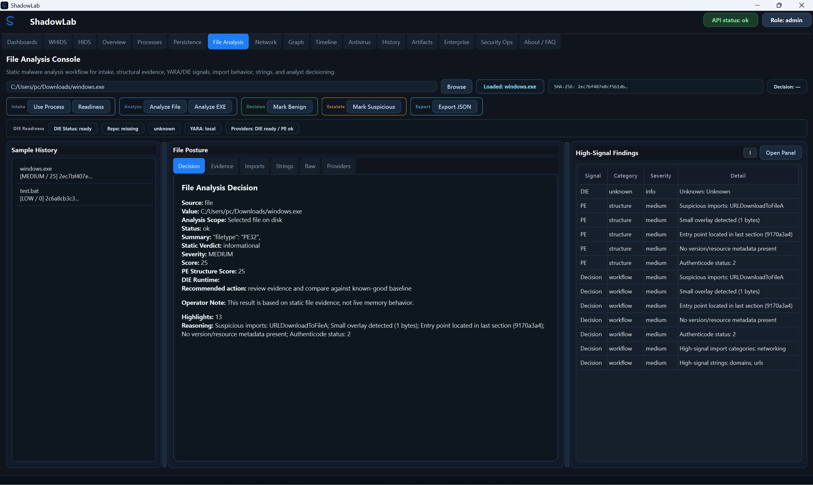
Detect It Easy, PE structure, file/process submission, and malware-analysis highlights.

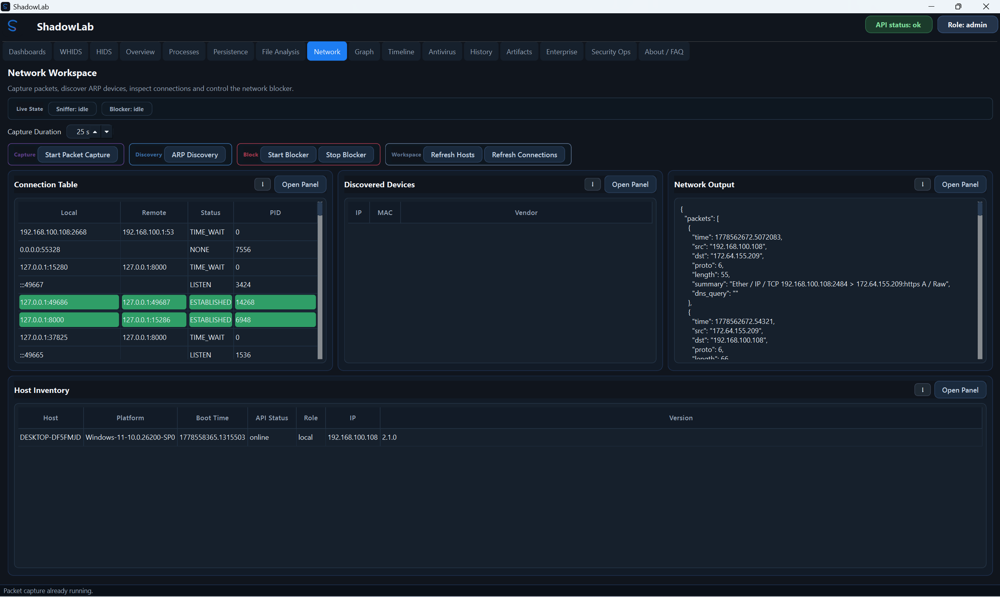
Network telemetry, packet capture, ARP discovery, blocker controls, and host inventory context.

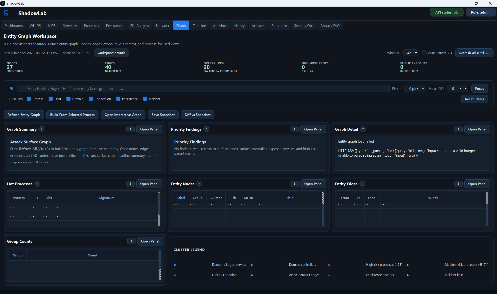
Relationship graph for entities, incidents, processes, and attack-surface correlation.

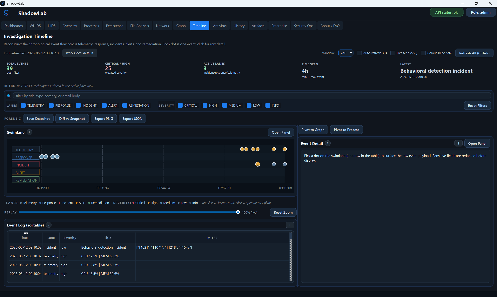
Chronological event story for incident reconstruction.

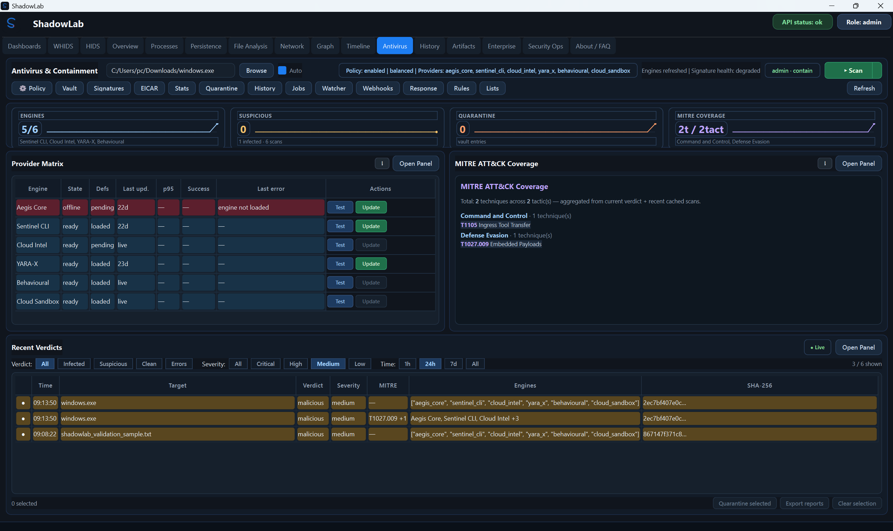
Provider health, verdicts, quarantine, response, rules, lists, webhooks, and containment controls.

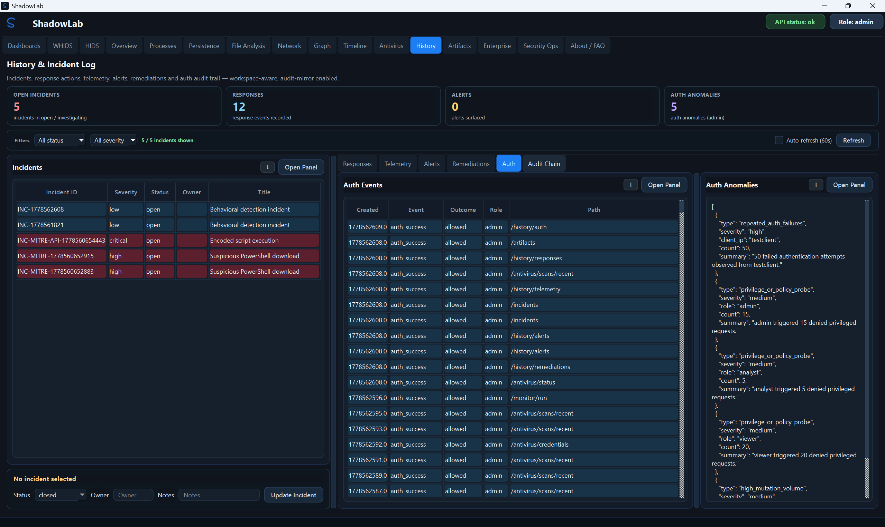
Incident, action, auth, and audit history for retrospective investigation.

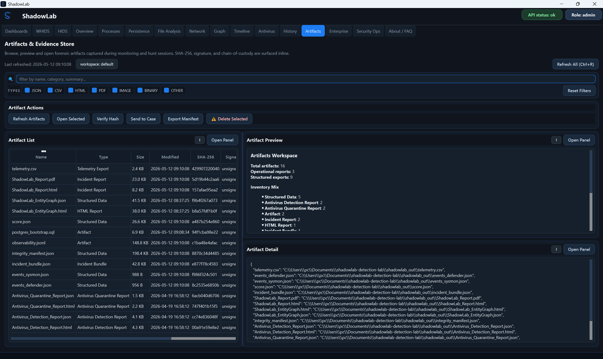
Central store for reports, evidence, and exported investigation artifacts.

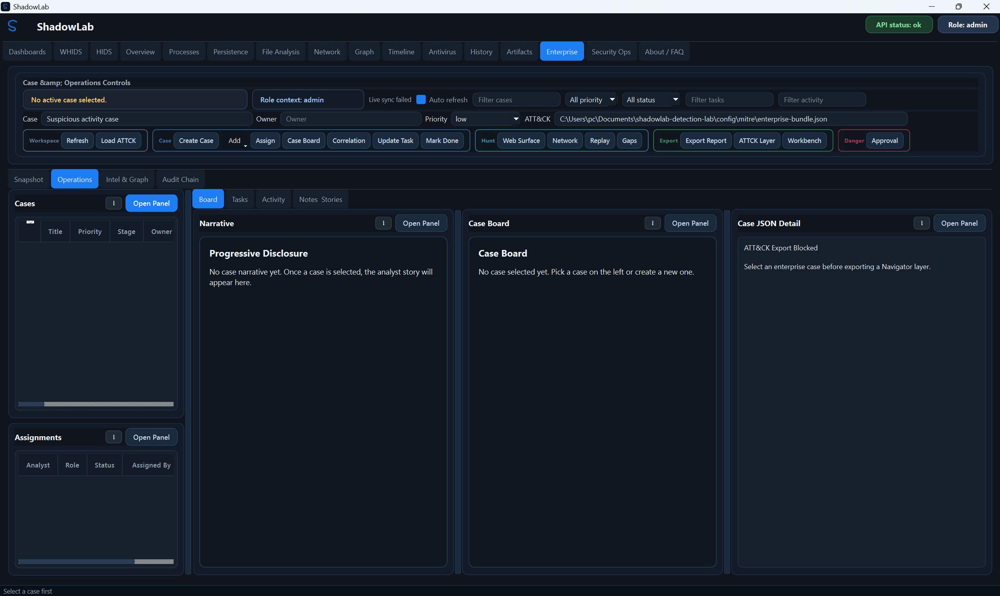
Case-centric enterprise workflow with assignments, tasks, approvals, notes, and exports.

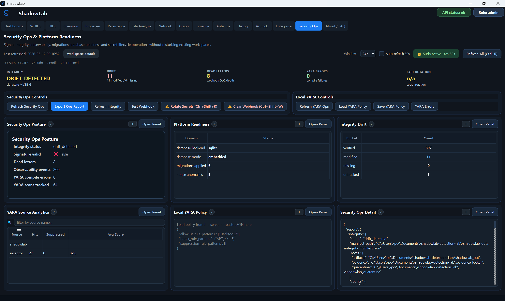
Operational readiness view for integrity, secrets, observability, YARA health, and reporting.

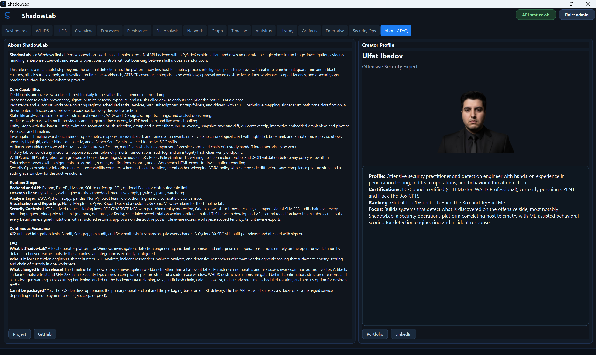
Product overview and creator profile with quick project links.

## Safety

ShadowLab includes lab-only capabilities such as response actions, packet inspection, ARP discovery, network blocker controls, and assessment helpers. Keep it in isolated environments and treat it like a security tool, not a general-purpose desktop app.
