# ShadowLab Platform Guide

ShadowLab is a locally operated, API-first cybersecurity operations platform whose day-to-day experience is centered around the desktop client. The project is no longer just a simple monitoring tool. In its current state, it provides a unified workspace for collecting host telemetry, investigating suspicious processes, reviewing persistence artifacts, enriching findings with threat intelligence and MITRE ATT&CK context, creating cases, running investigations, exporting reports, and maintaining security-operations oversight.

The goal of this document is to present the project in a more product-oriented way. It explains what ShadowLab is today, which major areas already exist, and how an operator can use the platform in practice.

## What ShadowLab Is Today

At the center of the platform is a FastAPI backend. All core operations are managed there. The PySide6 desktop client acts as the operator-facing surface for that backend. This gives the project a comfortable local lab workflow while still keeping the architecture open for future clients and automation.

The current product combines multiple layers. On one side, it includes telemetry, process investigation, response, persistence review, and threat-intelligence workflows. On the other side, it now includes an enterprise-style investigation layer with case boards, assignments, tasks, notes, stories, activity feeds, notification handling, scoped graph correlation, executive export, and security-operations controls.

## What Has Already Been Built

This repository has moved beyond the prototype stage. The main layers are already in place.

The backend layer has been established with routes for process investigation, triage, threat enrichment, persistence review, incidents, graph views, timeline views, artifacts, deception workflows, telemetry-fabric integration, and enterprise operations.

The desktop layer has also been expanded significantly. It is no longer only a simple process viewer. It now includes many tabs, role-aware controls, auth-enabled access, improved scrolling behavior, and a broader enterprise operator workflow.

The enterprise investigation layer was built specifically around the ShadowLab workflow. It includes case boards, assignments, checklist-style tasks, notes, stories, pins, saved views, case activity, scoped graph correlation, timeline support, a notification center, and investigation report export.

Important security improvements were also added. The role-based API key flow was corrected. The desktop no longer behaves like a fake admin when backend auth is disabled. Approval handling was hardened with a reserve-and-finalize model to protect one-time-use actions. Heavy enterprise refresh behavior was also softened to avoid UI freezes.

## How The Architecture Is Organized

The `api/` directory contains the main routes. The `services/` directory holds the investigation, graph, response, telemetry, incident, and enterprise logic. `database.py` manages the persistence layer in a way that supports both local SQLite and PostgreSQL migration paths. `desktop/` contains the operator UI. `docs/` stores usage and operational documentation. `scripts/` contains auth startup, packaging, migration, and verification helpers.

The strength of this design is that the UI and backend remain separate. That means the product is not just a single interface, but a platform that can be extended over time.

## Desktop Sections

`Dashboards` and `Overview` give the operator a broad picture of current platform state. These areas are intended for quick visibility into monitoring output, telemetry posture, and overall system condition.

`WHIDS` and `HIDS` sit directly after `Dashboards` in the desktop. These sections expose provider-oriented workflows for import, live status, evidence pull, scheduler state, and enterprise jump-off. `WHIDS` focuses on manager and export-based EDR ingestion, while `HIDS` focuses on OSSEC-style alert ingestion and response planning.

`Processes` is one of the main investigation entry points. It allows the operator to inspect process profiles, process trees, extracted strings, internals, YARAify enrichment, sandbox traces, AI analysis, and one-click triage.

That process workflow now also includes local YARA fallback, memory YARA enrichment, and fused verdict scoring built from curated `rules-master`, `signature-base`, and ShadowLab tradecraft rules. Broad community noise such as `domain.yar` and `RAT_PoetRATPython.yar` has been intentionally removed from the enterprise pack to keep verdicts readable.

`Advanced Hunt` is designed for deeper, operator-driven investigation work.

`Persistence` is used to review autoruns, scheduled tasks, services, and other persistence artifacts, and to trigger remediation when needed.

`Threat Intel` manages hash and IP enrichment flows. It connects local findings to providers such as VirusTotal, MalwareBazaar, AbuseIPDB, and YARAify-backed intelligence workflows.

`Deception` handles lab-oriented baiting and detection workflows such as honeypots and canaries.

`Network`, `Hosts`, `Graph`, and `Timeline` help the operator understand events in a wider context. These sections expose relationships, host inventory, graph correlation, and chronological event views.

`Quarantine`, `History`, and `Artifacts` are key sections for storing the outcome of investigation and response work. They make it possible to track what happened, what was contained, and which materials were collected.

`Enterprise` behaves as a separate investigation suite. It is split into two internal workspaces. `Enterprise Ops` manages case-centric workflow, while `Enterprise Intel` focuses on the intelligence and correlation side of case work.

`Security Ops` holds operational security controls such as integrity, observability, readiness, secret rotation, and reporting.

`Scenarios` and `About / FAQ` complete the platform with testing and presentation-oriented surfaces.

## What The Enterprise Layer Adds

Inside `Enterprise Ops`, the operator selects or creates a case and then sees the overall state of that case through the board. It becomes easy to understand who is working on it, which tasks remain open, which ones are overdue, what activity has taken place, and which notifications matter. Report export is also managed from here.

`Enterprise Intel` provides a more analytical view. It brings together critical asset visibility, detection lifecycle data, ATT&CK coverage, tactic heat, bundle lifecycle diff, case ATT&CK rollup, notes, stories, case timeline, entity links, and scoped graph correlation. This turns the case from a simple ticket into an actual investigation object.

This shift moves ShadowLab closer to a compact SOC-style investigation platform rather than just a defensive lab utility.

## How It Is Used In Practice

The simplest path is to start the backend first. If the goal is only local testing, `python app.py` is enough. If role-based behavior should be tested properly, then `scripts/start_shadowlab_auth.ps1` is the better entry point.

After that, the desktop is started with `python desktop/main.py`. If auth is enabled, the correct API key is entered into the client. From there, the operator can first review `Overview` and `Dashboards`. If suspicious activity appears, the operator can move into `Processes` and `Advanced Hunt` for deeper inspection.

If an event grows into an incident or case-level workflow, a case is created under `Enterprise`. Then tasks are assigned, notes and stories are written, evidence is pinned, graph correlation is reviewed, and the final report is exported.

If the focus is platform hardening or platform health, the operator moves into `Security Ops`, where integrity, observability, secrets, and readiness can be reviewed.

If the focus is external detection tooling, the operator usually enters through `WHIDS` or `HIDS`, normalizes those detections into ShadowLab incidents, and then moves into `Enterprise` for case-driven work.

If the focus is ATT&CK maturity, the operator loads a STIX bundle, reviews the discovered bundle list and diff, then works from case-level ATT&CK coverage. From there the operator can export a Navigator layer, export a Workbench coverage bundle, and review technique-aware response decisions.

## MITRE ATT&CK Layer

ShadowLab now has a dedicated ATT&CK layer inside the enterprise workflow.

The backend keeps bundle lifecycle state such as bundle version, modified date, object counts, discovered candidate bundles, and diff results against the currently loaded dataset. This gives the operator a simple way to understand whether the ATT&CK dataset is current and what changed between versions.

Incident and case coverage are no longer limited to the stored `mitre_mapping` field. ShadowLab also performs lightweight ATT&CK inference from incident title, summary, notes, process-execution language, download behavior, credential-access hints, persistence hints, lateral-movement cues, and exfiltration patterns. This gives better ATT&CK visibility when upstream tools did not provide full mapping.

Case-level ATT&CK views now include tactic heat, tactic progression, sub-technique counts, parent-technique rollups, top mitigations, and top software overlap. That makes the enterprise workspace more useful for both analysis and reporting.

Navigator export is still supported, but ShadowLab now also exports a Workbench-oriented coverage JSON so ATT&CK relationship and annotation work can continue outside the product when needed.

## Recommended Operator Flow

The most practical flow starts with `Overview` and `Dashboards` for general awareness. The second stage is process investigation. The third stage expands context using persistence review, threat intelligence, graph, and timeline. The fourth stage opens a case and starts enterprise workflow. The fifth stage exports reports and artifacts. The sixth stage uses security-operations controls to verify platform health and evidence integrity.

This flow shows one of ShadowLab's main strengths. It does not only display data, it also gives the operator a structured way to work through that data.

## Validation And Readiness

ShadowLab now includes repeatable validation helpers for deployment and workflow maturity.

Current validation coverage includes:

- deployment preflight and runtime-restore checks
- RBAC smoke tests for `viewer`, `analyst`, and `admin`
- live ShadowLab and `WHIDS` integration smoke tests
- performance and dedupe probes for large ingest paths
- native `OSSEC` active-response validation on elevated Windows hosts
- local YARA compile-health and `Inceptor` payload validation

That matters because the platform now contains response, orchestration, and integration features that should be re-tested, not only assumed.

## Visual Tour

The screenshots below follow the desktop surface in a section-oriented order. Each screenshot is followed by a short explanation of what that workspace is used for.

### Dashboards Workspace

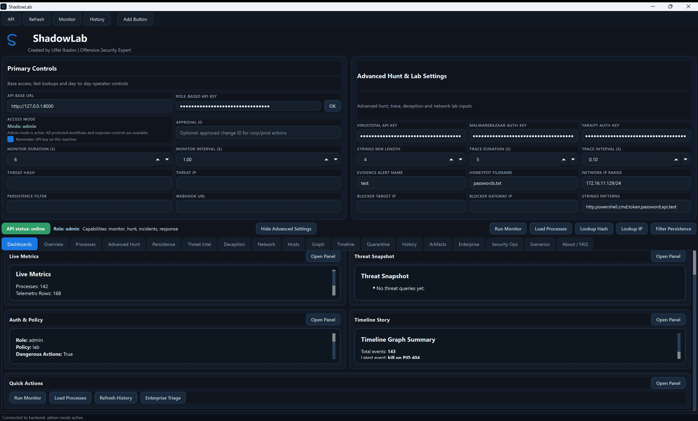

This screen gives the operator an immediate summary of the platform's current state. Live metrics, auth and policy posture, threat snapshots, and timeline summaries are visible in one place. The dashboards area works well as an initial checkpoint before deeper investigation begins. It helps the operator quickly decide where attention should go next.

### Overview Telemetry Dashboard

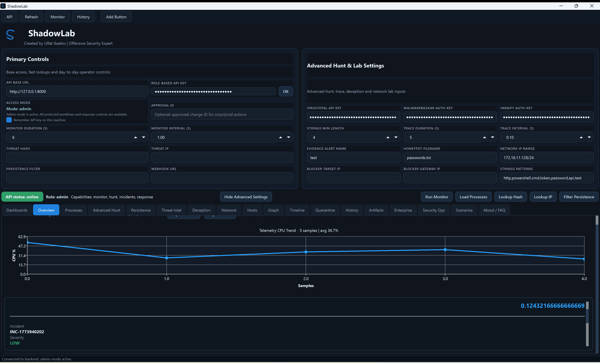

The overview section is meant for reading telemetry in a more focused way. CPU trends, incident summaries, and current monitoring results are displayed more clearly here. This screen is especially useful for noticing anomalies or changes in behavior early. Operators often move from this view into process- or incident-level investigation.

### Process Intelligence Workspace

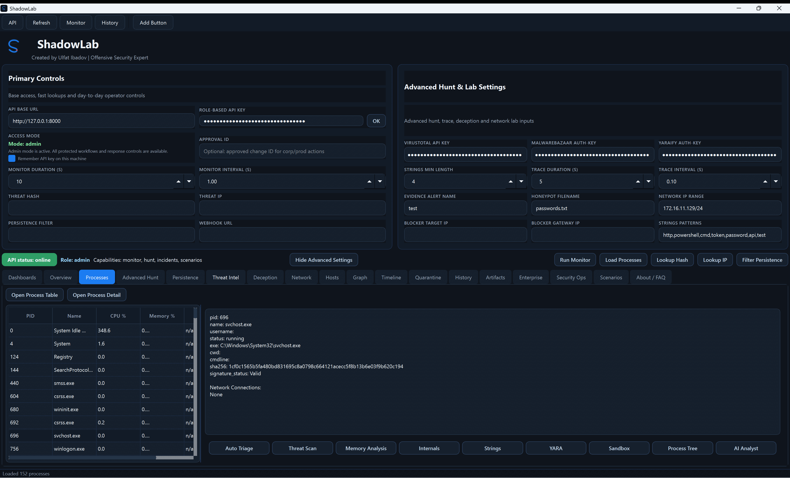

This workspace is the core area for suspicious-process analysis. The process list sits on the left, while detailed context for the selected process appears on the right. From here the operator can launch triage, strings extraction, YARA workflows, sandbox traces, memory analysis, and other investigation actions. In practice, much of the hands-on analytical work happens here.

### Advanced Hunt Workspace

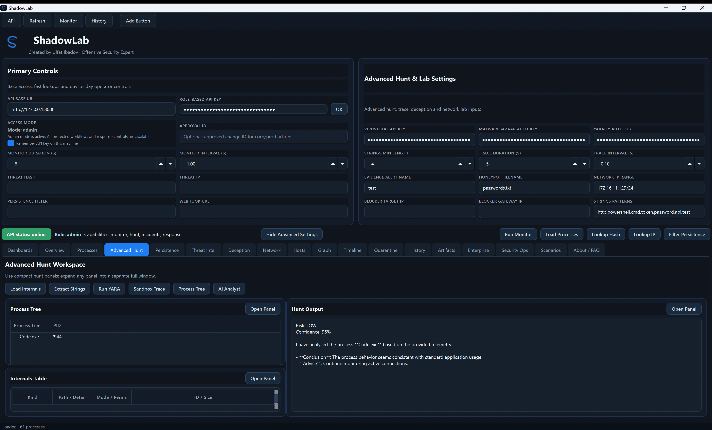

Advanced Hunt is built for deeper operator-driven searches. It behaves like a panel-based workspace that combines internals, strings, YARA, process tree, and AI analyst output. This lets the operator review raw telemetry with a more analytical workflow. It is the section that moves the user from observation into active hunting.

### Persistence Workspace

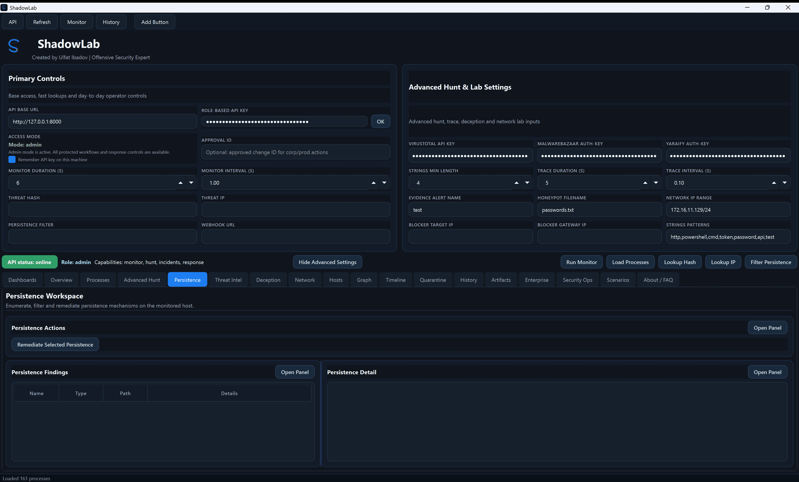

The persistence workspace helps track how software may be attempting to remain on the system. Autoruns, services, scheduled tasks, and related mechanisms are reviewed here. If a risky persistence artifact is found, remediation can be triggered from the same section. This makes it an important post-exploitation review surface.

### Threat Intel Workspace

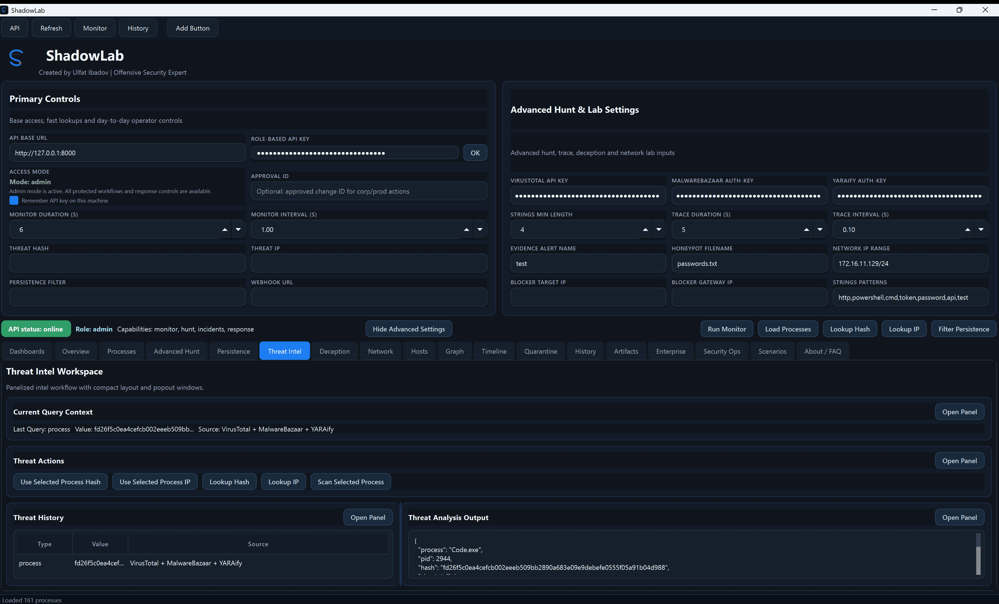

The threat-intelligence screen connects hashes, IPs, and process context to external enrichment. The operator can select an object and check it against providers such as VirusTotal, MalwareBazaar, and YARAify-backed sources. This enriches local telemetry with broader threat context. As a result, investigation decisions can be made with more confidence.

### Deception And Evidence Workspace

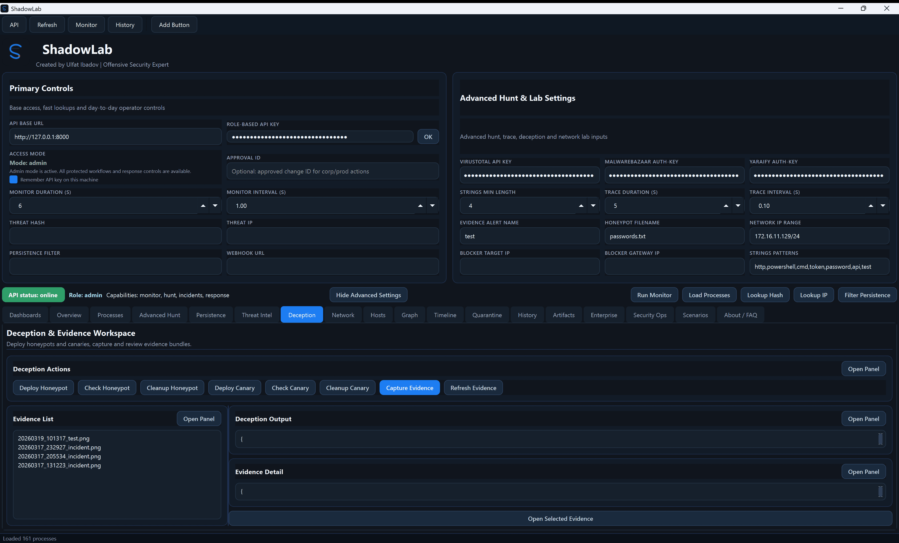

This screen keeps deception workflows and evidence capture in one place. Honeypot actions, canary actions, evidence lists, and output panels are all presented together. It is a convenient area for building bait-based workflows and collecting the resulting material in lab environments. It is especially useful in testing and demonstration scenarios.

### Network Workspace

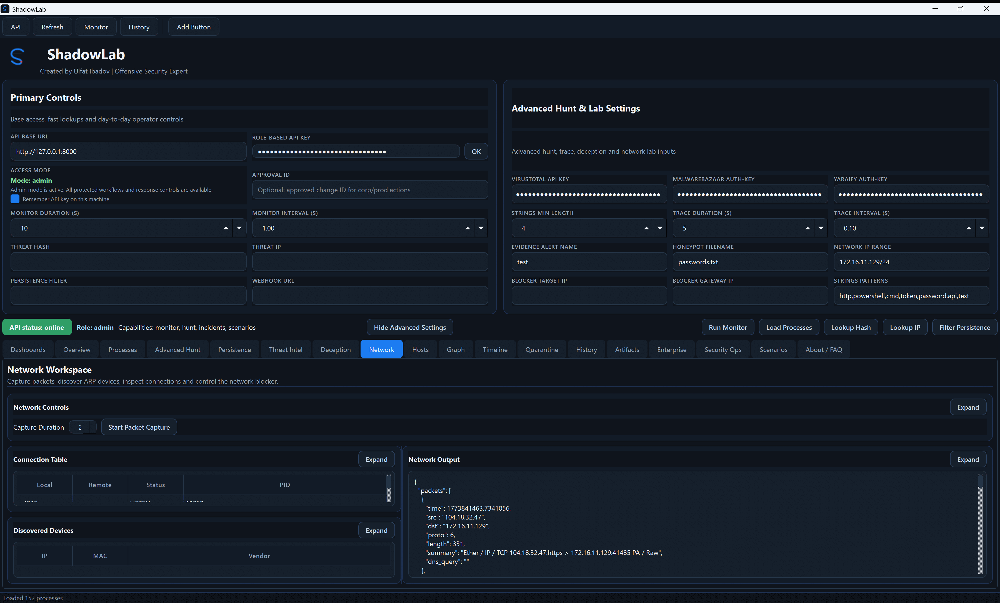

The network section is meant for packet and connection context. Connection tables, discovered devices, and network output help the operator understand traffic more clearly. This allows host behavior to be evaluated from a network perspective rather than only a process perspective. It is useful for spotting lateral movement or suspicious outbound activity.

### Hosts Inventory Workspace

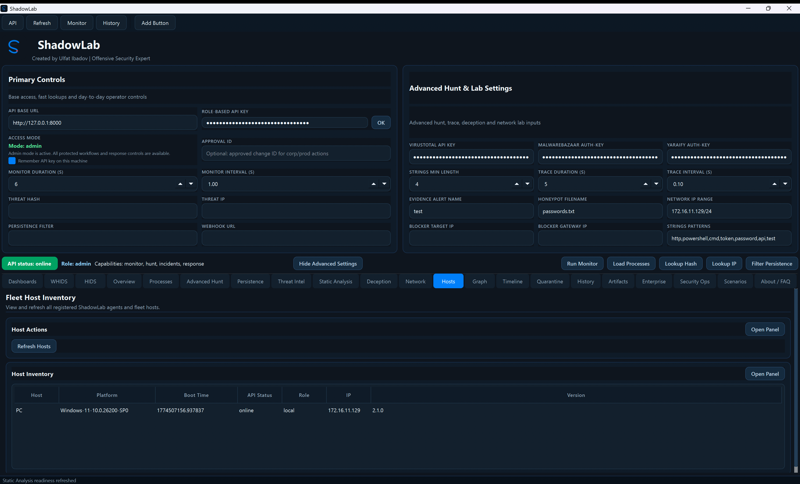

The hosts workspace presents registered hosts and agent state in a compact inventory view. Platform, IP, role, API status, and version information are easy to read here. This is valuable in a lab or mini-fleet setup with more than one monitored host. Operators can quickly understand which systems are online and which ones need attention.

### Graph Workspace

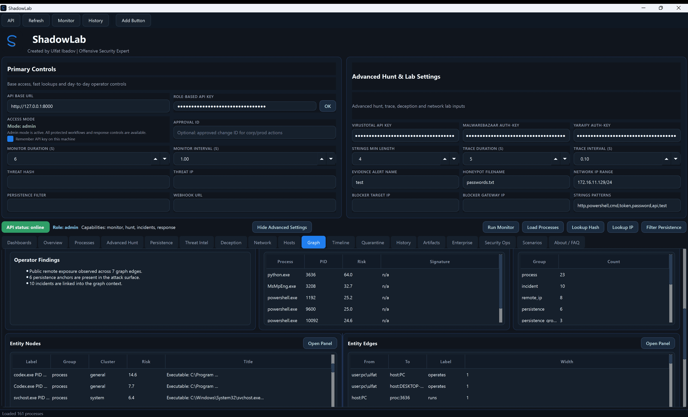

The graph workspace visualizes relationships between events and entities. Entity nodes, entity edges, and operator findings make correlation easier to understand at a glance. This section is not about a single object but about the shape of the investigation as a whole. It becomes especially valuable during case-level analysis.

### Timeline Event Story Workspace

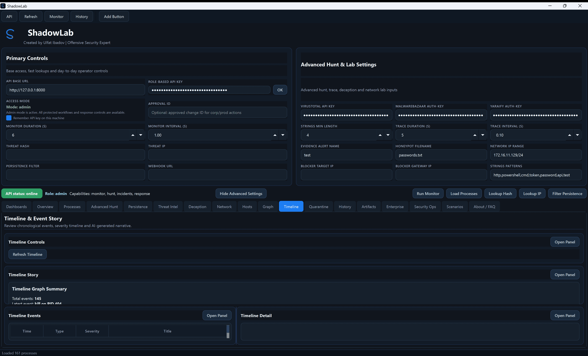

The timeline workspace is used to read events in chronological order. Event summaries, timeline stories, and detail panels together provide a narrative view of what happened and when. The operator can more easily trace which action came before another. That makes this section very useful for incident reconstruction.

### Quarantine Alert Workspace

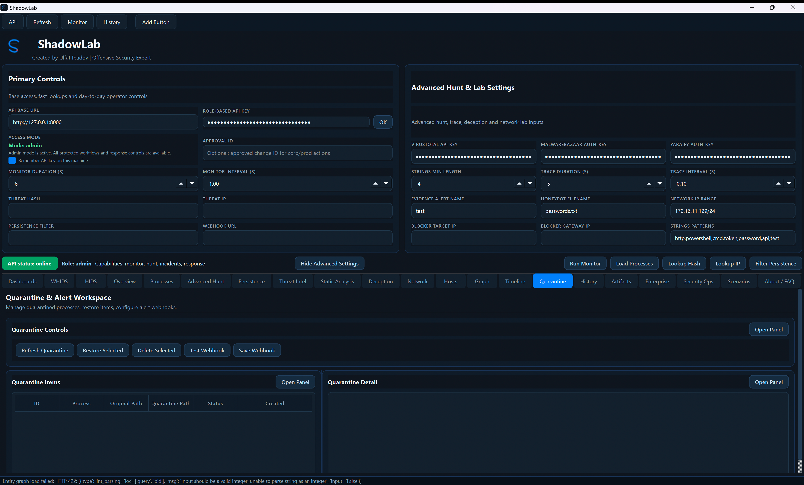

The quarantine workspace is used to manage isolated items and related alerts. Restore, delete, and webhook actions are available directly to the operator. It helps keep the response side of the platform organized. It is especially helpful for tracking the final state of already-handled objects.

### History And Incident Log

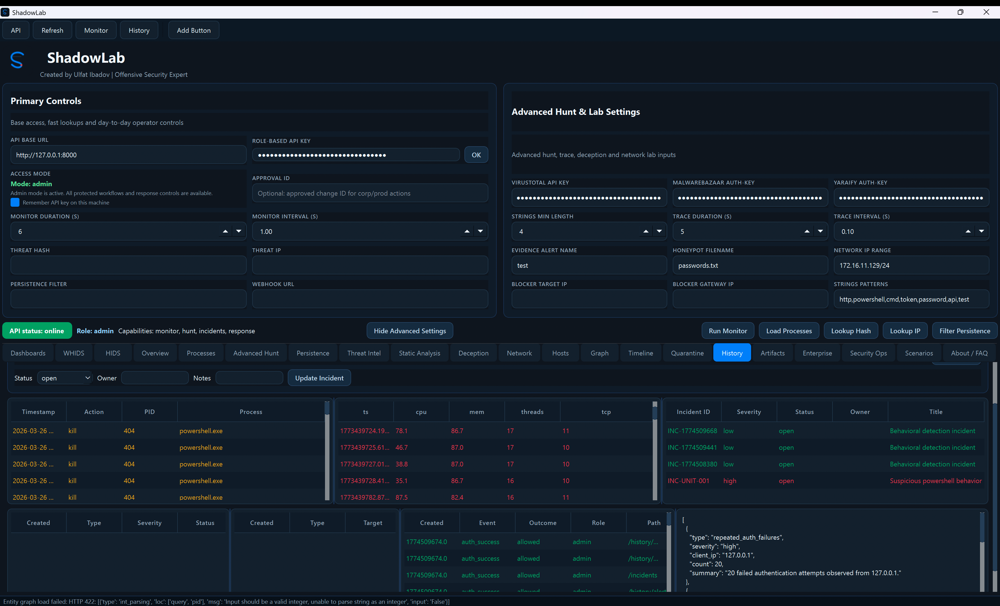

The history section collects incident, audit, and telemetry traces in one place. Action tables, severity, ownership, and event details are all visible together. Operators use this section when they need to look backward and trace what happened. It is highly valuable for both response review and retrospective analysis.

### Artifacts And Evidence Store

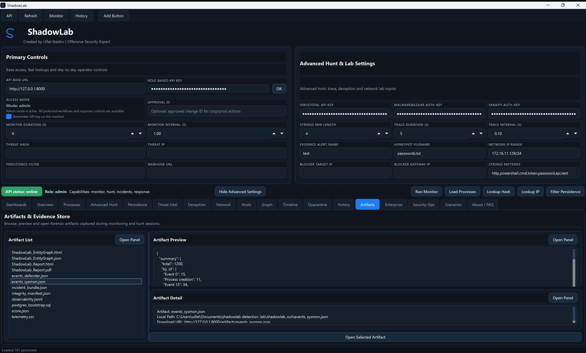

The artifacts workspace stores collected files, reports, and forensic outputs. The preview and detail panels help the operator understand what the selected item contains. In effect, it serves as a central repository for investigation materials. That makes export and later review much easier.

### Enterprise Case Ops Workspace

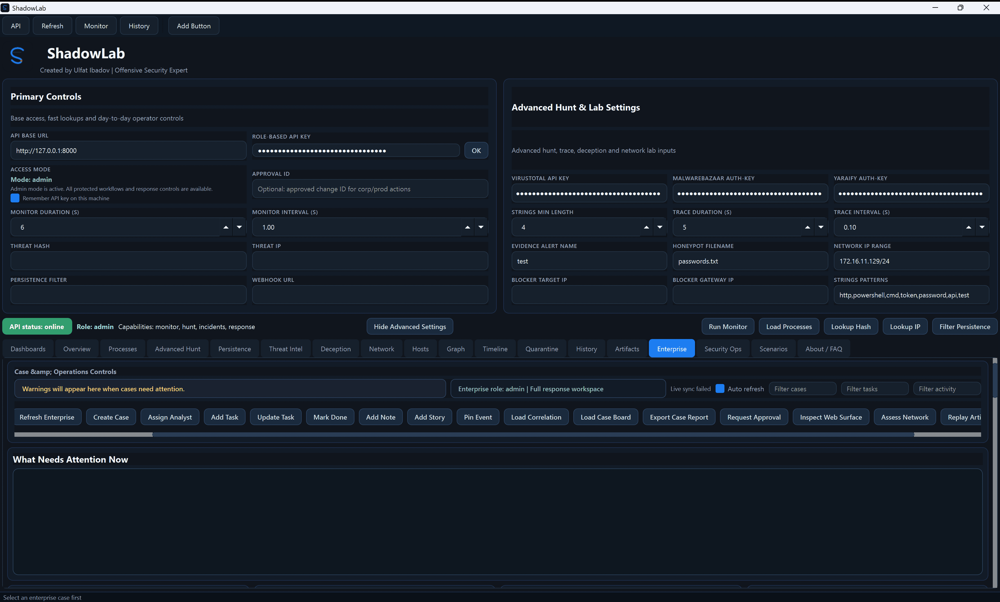

Enterprise Ops is the main panel for case-centric work. Case controls, assignments, tasks, notes, stories, approvals, and export actions come together here. This section is central to organizing SOC-style investigations. It is where individual findings turn into structured team workflow.

### Security Ops Platform Readiness

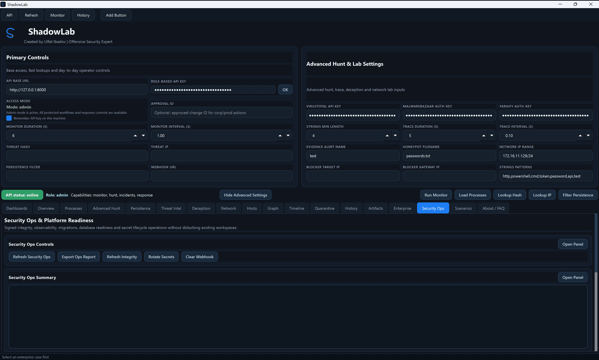

The Security Ops workspace shows the health of the platform itself and the state of operational controls. Integrity, observability, migrations, secret rotation, and readiness tasks are gathered here. This emphasizes that the product is not only about detection but also about operational maturity. It gives administrators a dedicated place for platform oversight.

### Attack Scenario Simulator

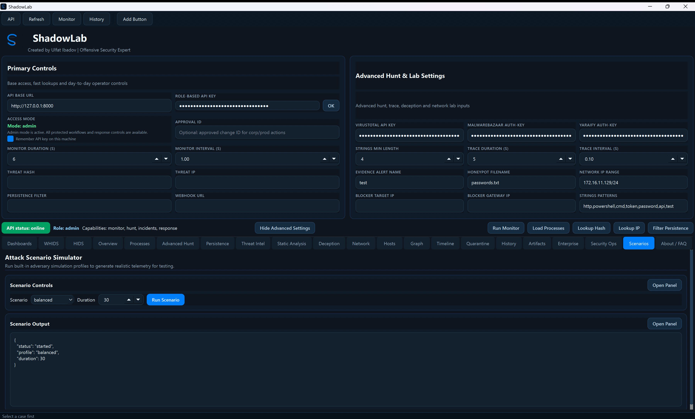

The scenarios section is designed for testing and demonstration. From here, the operator can run a chosen adversary-style scenario for a defined duration. This makes it possible to validate telemetry, detections, and workflows in a controlled way. It is particularly useful for demos, labs, and regression-style checks.

### Enterprise Ops Snapshot

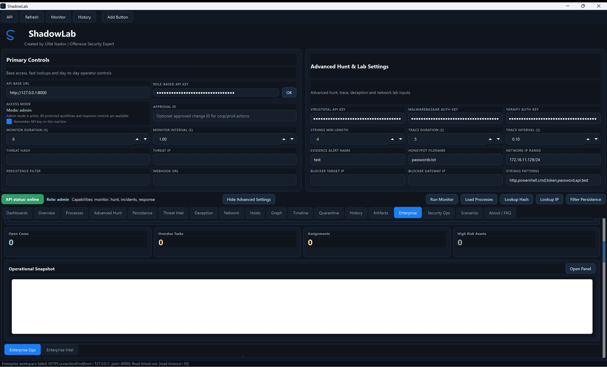

This screen provides a higher-level enterprise operations summary. Open cases, assignments, high-risk assets, and operational snapshots help summarize current workload. It is useful for managers or lead analysts who need a broader directional view. It helps the team quickly understand where focus is needed most.

### About Creator Profile

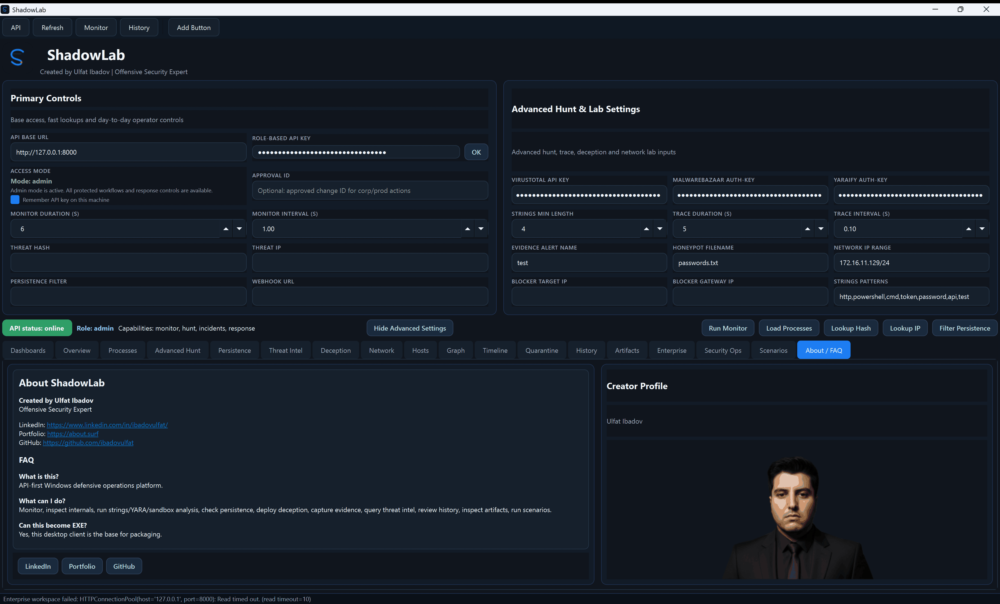

The About / FAQ section explains who created the product and what it is intended to be. Creator profile details, portfolio links, and a concise FAQ are shown together here. This section is especially useful for presentation, onboarding, and repository context. It gives the product a clear human and project identity after the technical sections.

## What This Guide Is Useful For

This guide works well for product presentation, onboarding, and answering the question of what the project really does on GitHub. The README can remain a shorter project entry point. This guide serves as the broader, more product-oriented explanation.
