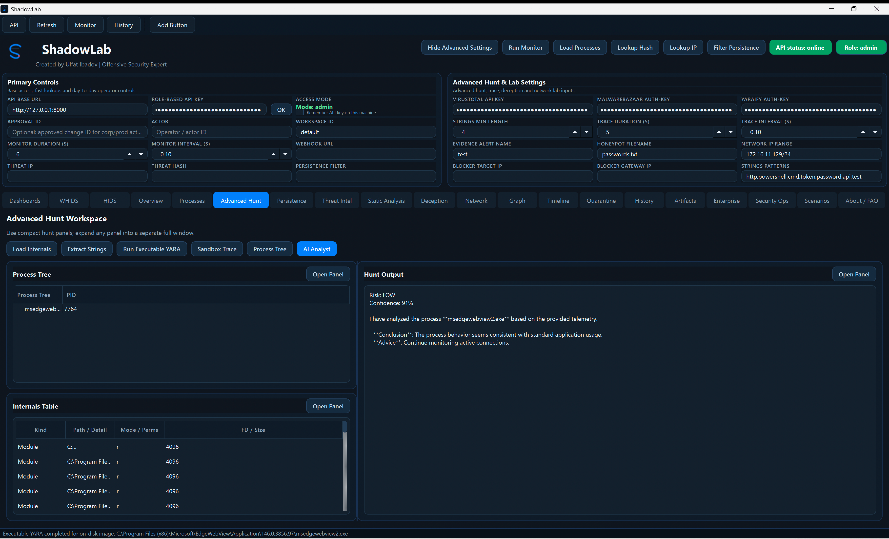
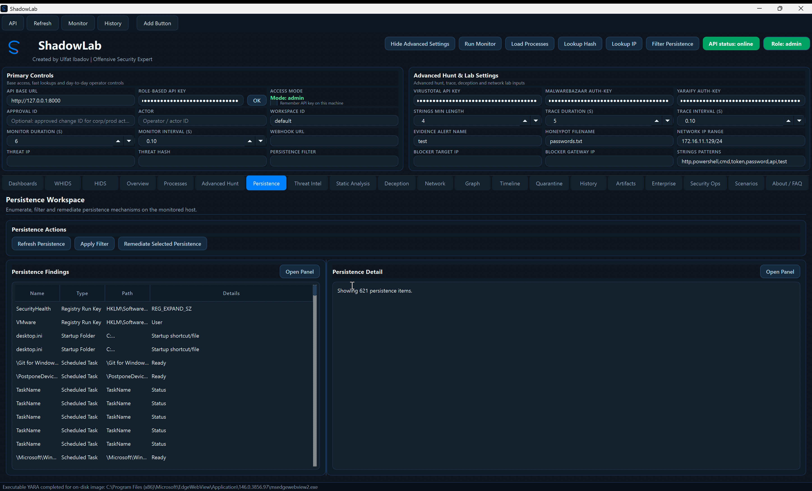
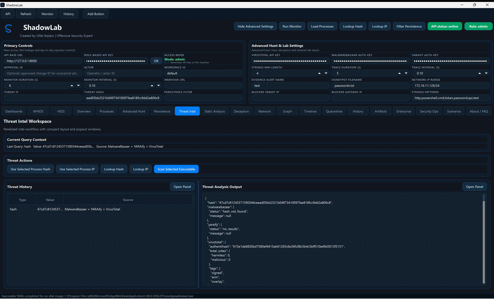
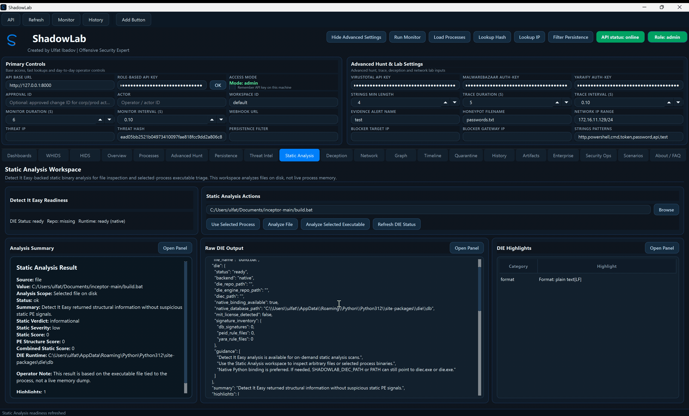
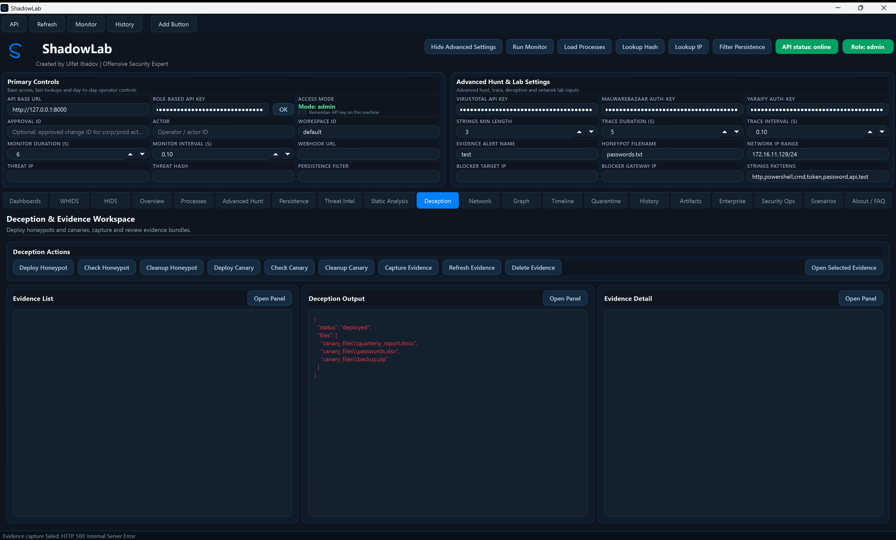
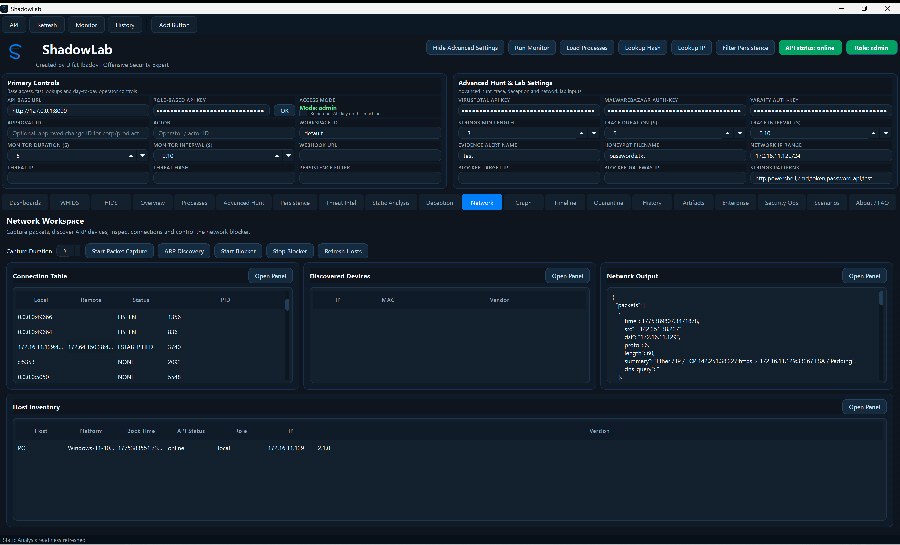
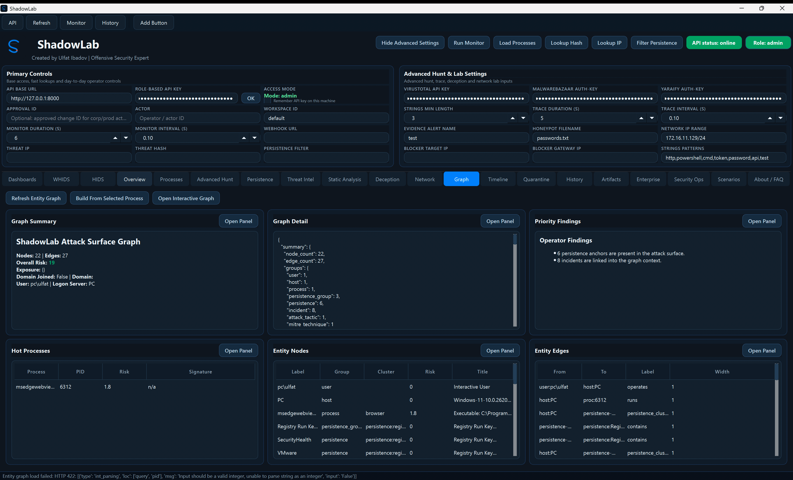
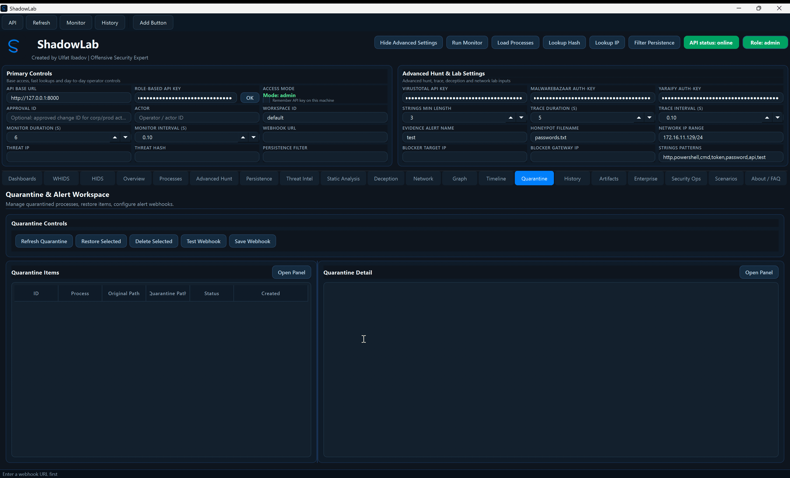
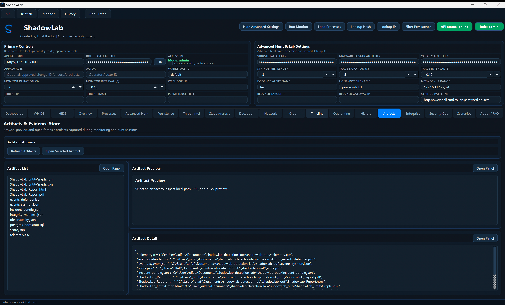
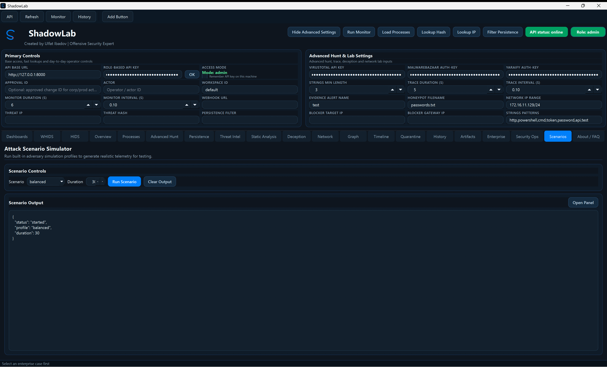

# ShadowLab Platform Guide

ShadowLab is a locally operated, API-first cybersecurity operations platform whose day-to-day experience is centered around the desktop client. The project is no longer just a simple monitoring tool. In its current state, it provides a unified workspace for collecting host telemetry, investigating suspicious processes, reviewing persistence artifacts, enriching findings with threat intelligence and MITRE ATT&CK context, creating cases, running investigations, exporting reports, and maintaining security-operations oversight.

The goal of this document is to present the project in a more product-oriented way. It explains what ShadowLab is today, which major areas already exist, and how an operator can use the platform in practice.

## What ShadowLab Is Today

At the center of the platform is a FastAPI backend. All core operations are managed there. The PySide6 desktop client acts as the operator-facing surface for that backend. This gives the project a comfortable local lab workflow while still keeping the architecture open for future clients and automation.

The current product combines multiple layers. On one side, it includes telemetry, process investigation, response, persistence review, and threat-intelligence workflows. On the other side, it now includes an enterprise-style investigation layer with case boards, assignments, tasks, notes, stories, activity feeds, notification handling, scoped graph correlation, executive export, and security-operations controls.

## What Has Already Been Built

This repository has moved beyond the prototype stage. The main layers are already in place.

The backend layer has been established with routes for process investigation, triage, threat enrichment, persistence review, incidents, graph views, timeline views, artifacts, deception workflows, telemetry-fabric integration, and enterprise operations.

The desktop layer has also been expanded significantly. It is no longer only a simple process viewer. It now includes many tabs, role-aware controls, auth-enabled access, improved scrolling behavior, and a broader enterprise operator workflow.

The enterprise investigation layer was built specifically around the ShadowLab workflow. It includes case boards, assignments, checklist-style tasks, notes, stories, pins, saved views, case activity, scoped graph correlation, timeline support, a notification center, and investigation report export.

Important security improvements were also added. The role-based API key flow was corrected. The desktop no longer behaves like a fake admin when backend auth is disabled. Approval handling was hardened with a reserve-and-finalize model to protect one-time-use actions. Heavy enterprise refresh behavior was also softened to avoid UI freezes.

## How The Architecture Is Organized

The `api/` directory contains the main routes. The `services/` directory holds the investigation, graph, response, telemetry, incident, and enterprise logic. `database.py` manages the persistence layer in a way that supports both local SQLite and PostgreSQL migration paths. `desktop/` contains the operator UI. `docs/` stores usage and operational documentation. `scripts/` contains auth startup, packaging, migration, and verification helpers.

The strength of this design is that the UI and backend remain separate. That means the product is not just a single interface, but a platform that can be extended over time.

## Desktop Sections

`Dashboards` and `Overview` give the operator a broad picture of current platform state. These areas are intended for quick visibility into monitoring output, telemetry posture, and overall system condition.

`WHIDS` and `HIDS` sit directly after `Dashboards` in the desktop. These sections expose provider-oriented workflows for import, live status, evidence pull, scheduler state, and enterprise jump-off. `WHIDS` focuses on manager and export-based EDR ingestion, while `HIDS` focuses on OSSEC-style alert ingestion and response planning.

`Processes` is one of the main investigation entry points. It allows the operator to inspect process profiles, process trees, extracted strings, internals, YARAify enrichment, sandbox traces, AI analysis, and one-click triage.

That process workflow now also includes local YARA fallback, memory YARA enrichment, and fused verdict scoring built from curated `rules-master`, `signature-base`, and ShadowLab tradecraft rules. Broad community noise such as `domain.yar` and `RAT_PoetRATPython.yar` has been intentionally removed from the enterprise pack to keep verdicts readable.

`Advanced Hunt` is designed for deeper, operator-driven investigation work.

`Persistence` is used to review autoruns, scheduled tasks, services, and other persistence artifacts, and to trigger remediation when needed.

`Threat Intel` manages hash and IP enrichment flows. It connects local findings to providers such as VirusTotal, MalwareBazaar, AbuseIPDB, and YARAify-backed intelligence workflows.

`Static Analysis` provides the Detect It Easy and structural PE-analysis surface. It gives the operator a dedicated place to inspect file-oriented malware-analysis results separate from live process triage. The workspace prefers the native `die-python` backend, shows native runtime readiness correctly in the desktop, and falls back to subprocess or PE-structure inspection only when necessary.

`Deception` handles lab-oriented baiting and detection workflows such as honeypots and canaries.

`Network`, `Hosts`, `Graph`, and `Timeline` help the operator understand events in a wider context. These sections expose relationships, host inventory, graph correlation, and chronological event views.

`Quarantine`, `History`, and `Artifacts` are key sections for storing the outcome of investigation and response work. They make it possible to track what happened, what was contained, and which materials were collected. Report output in `Artifacts` is now fuller and includes executive summary, analyst findings, telemetry context, event highlights, and artifact inventory.

`Enterprise` behaves as a separate investigation suite. It is split into two internal workspaces. `Enterprise Ops` manages case-centric workflow, while `Enterprise Intel` focuses on the intelligence and correlation side of case work.

`Security Ops` holds operational security controls such as integrity, observability, readiness, secret rotation, and reporting.

`Scenarios` and `About / FAQ` complete the platform with testing and presentation-oriented surfaces. The About area is now split cleanly between product-level ShadowLab messaging on the left and creator-profile identity on the right.

## What The Enterprise Layer Adds

Inside `Enterprise Ops`, the operator selects or creates a case and then sees the overall state of that case through the board. It becomes easy to understand who is working on it, which tasks remain open, which ones are overdue, what activity has taken place, and which notifications matter. Report export is also managed from here.

`Enterprise Intel` provides a more analytical view. It brings together critical asset visibility, detection lifecycle data, ATT&CK coverage, tactic heat, bundle lifecycle diff, case ATT&CK rollup, notes, stories, case timeline, entity links, and scoped graph correlation. This turns the case from a simple ticket into an actual investigation object.

This shift moves ShadowLab closer to a compact SOC-style investigation platform rather than just a defensive lab utility.

## How It Is Used In Practice

The simplest path is to start the backend first. If the goal is only local testing, `python app.py` is enough. If role-based behavior should be tested properly, then `scripts/start_shadowlab_auth.ps1` is the better entry point.

After that, the desktop is started with `python desktop/main.py`. If auth is enabled, the correct API key is entered into the client. From there, the operator can first review `Overview` and `Dashboards`. If suspicious activity appears, the operator can move into `Processes` and `Advanced Hunt` for deeper inspection.

If an event grows into an incident or case-level workflow, a case is created under `Enterprise`. Then tasks are assigned, notes and stories are written, evidence is pinned, graph correlation is reviewed, and the final report is exported.

If the focus is platform hardening or platform health, the operator moves into `Security Ops`, where integrity, observability, secrets, and readiness can be reviewed.

If the focus is external detection tooling, the operator usually enters through `WHIDS` or `HIDS`, normalizes those detections into ShadowLab incidents, and then moves into `Enterprise` for case-driven work.

If the focus is ATT&CK maturity, the operator loads a STIX bundle, reviews the discovered bundle list and diff, then works from case-level ATT&CK coverage. From there the operator can export a Navigator layer, export a Workbench coverage bundle, and review technique-aware response decisions.

## MITRE ATT&CK Layer

ShadowLab now has a dedicated ATT&CK layer inside the enterprise workflow.

The backend keeps bundle lifecycle state such as bundle version, modified date, object counts, discovered candidate bundles, and diff results against the currently loaded dataset. This gives the operator a simple way to understand whether the ATT&CK dataset is current and what changed between versions.

Incident and case coverage are no longer limited to the stored `mitre_mapping` field. ShadowLab also performs lightweight ATT&CK inference from incident title, summary, notes, process-execution language, download behavior, credential-access hints, persistence hints, lateral-movement cues, and exfiltration patterns. This gives better ATT&CK visibility when upstream tools did not provide full mapping.

Case-level ATT&CK views now include tactic heat, tactic progression, sub-technique counts, parent-technique rollups, top mitigations, and top software overlap. That makes the enterprise workspace more useful for both analysis and reporting.

Navigator export is still supported, but ShadowLab now also exports a Workbench-oriented coverage JSON so ATT&CK relationship and annotation work can continue outside the product when needed.

## Recommended Operator Flow

The most practical flow starts with `Overview` and `Dashboards` for general awareness. The second stage is process investigation. The third stage expands context using persistence review, threat intelligence, graph, and timeline. The fourth stage opens a case and starts enterprise workflow. The fifth stage exports reports and artifacts. The sixth stage uses security-operations controls to verify platform health and evidence integrity.

This flow shows one of ShadowLab's main strengths. It does not only display data, it also gives the operator a structured way to work through that data.

## Validation And Readiness

ShadowLab now includes repeatable validation helpers for deployment and workflow maturity.

Current validation coverage includes:

- deployment preflight and runtime-restore checks
- RBAC smoke tests for `viewer`, `analyst`, and `admin`
- live ShadowLab and `WHIDS` integration smoke tests
- performance and dedupe probes for large ingest paths
- native `OSSEC` active-response validation on elevated Windows hosts
- local YARA compile-health and `Inceptor` payload validation

That matters because the platform now contains response, orchestration, and integration features that should be re-tested, not only assumed.

## Visual Tour

The screenshots below now map directly to the updated desktop image set in `images/`. The sequence follows the top-level desktop navigation from left to right.

### Dashboards Workspace

The dashboards surface is the quickest status board in the product. It condenses platform health, threat posture, auth state, and short investigation summaries into one operator-facing wall so the next pivot is obvious.

### WHIDS Workspace

The WHIDS workspace is the EDR-oriented integration panel. It brings manager sync, reports, artifacts, scheduler state, IoC/rule lifecycle, and enterprise jump-off into a single admin-facing control area.

### HIDS Workspace

The HIDS workspace is centered on OSSEC-style ingest and response planning. Operators use it to import alert streams, monitor live-ingest state, and pivot normalized incidents into the rest of the platform.

### Overview Incident Brief

Overview is the high-signal telemetry reading area. It highlights incident posture, monitor results, and the current detection story in a cleaner briefing format than the dashboard wall.

### Process Intelligence Workspace

This is the main suspicious-process analysis surface. The process list, selected-process detail, triage output, and action strip work together here, making it the most common starting point for host-level investigation.

### Advanced Hunt Workspace

Advanced Hunt acts like a compact analyst console. It keeps deeper process review and hunt output close together so internals, strings, sandbox, YARA, and AI-assisted reasoning can be reviewed in one iterative workspace.

### Persistence Workspace

Persistence gives the operator a dedicated post-compromise review area for autoruns, tasks, services, and rollback-aware remediation. It is where long-lived footholds are verified or cleaned up.

### Threat Intel Workspace

Threat Intel connects hashes, IPs, and process context to outside enrichment. It is designed for fast reputation checks, provider comparison, and operator-readable correlation rather than raw feed browsing.

### Static Analysis Workspace

Static Analysis is the file-focused malware-analysis section. It presents Detect It Easy readiness, file/process submission, highlight extraction, and raw output in a way that complements live triage without overloading the process workspace.

### Deception And Evidence Workspace

This workspace joins deception and evidence handling on purpose. Honeypots, canaries, evidence capture, evidence review, and related output sit together so testing and collection stay in the same operator flow.

### Network Workspace

Network gives connection and discovery context that process views alone cannot provide. It helps the operator evaluate suspicious hosts or processes through packet, socket, and device perspective.

### Hosts Inventory Workspace

Hosts is the fleet-oriented inventory layer. It is especially useful in multi-host lab setups where the operator needs a compact view of platform, IP, role, version, and current state.

### Graph Interactive Browser

Graph visualizes relationships across entities, incidents, persistence items, and remote endpoints. It turns investigative context into a shape the operator can read and explain quickly.

### Timeline Event Story Workspace

Timeline reconstructs the incident story chronologically. It helps the operator move from “what is suspicious” to “what happened first, what followed, and what matters next.”

### Quarantine Alert Workspace

Quarantine is the containment follow-through surface. Restore, delete, and related alerting actions are visible in one place so isolated items remain auditable and manageable.

### History And Incident Log

History centralizes incident, action, and telemetry traces. It is the place to revisit decisions, confirm who changed what, and support retrospective incident review.

### Artifacts And Evidence Store

Artifacts stores reports, exports, and collected evidence in an operator-friendly repository. Preview and detail panels make it practical to inspect outputs without leaving the product.

### Enterprise Case Ops Workspace

Enterprise is the structured investigation suite. The screenshot reflects the case-centric operations side, where tasks, approvals, assignments, notes, export actions, and case workflow are managed.

### Security Ops Workspace

Security Ops is the platform-readiness and operational-maturity area. Integrity, observability, local YARA health, secret handling, and report/export controls are grouped here for operators and administrators.

### Attack Scenario Simulator

Scenarios provides a controlled telemetry-generation surface for testing and demonstrations. It is valuable when detections, integrations, or workflows need a repeatable stimulus.

### About Creator Profile

The About / FAQ area now cleanly separates product identity from creator identity. ShadowLab messaging, project links, and quick FAQ stay on the left, while the creator profile and personal links stay on the right.

## What This Guide Is Useful For

This guide works well for product presentation, onboarding, and answering the question of what the project really does on GitHub. The README can remain a shorter project entry point. This guide serves as the broader, more product-oriented explanation.

updated

